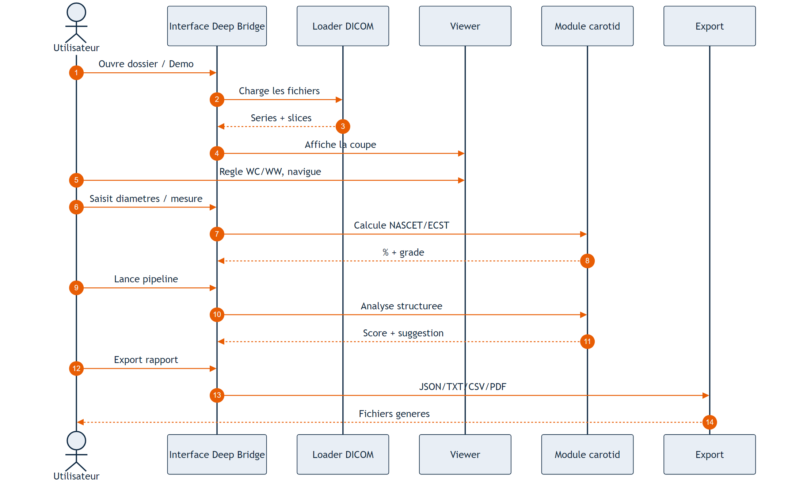
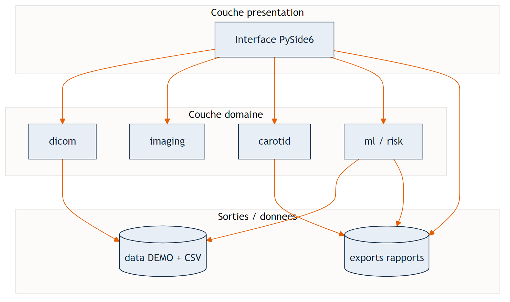
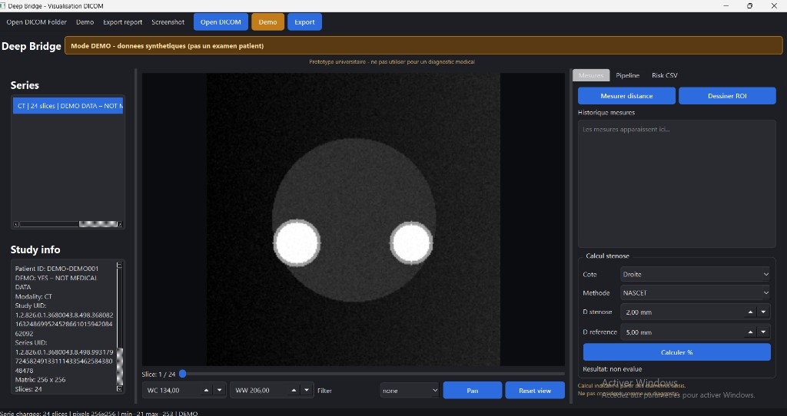
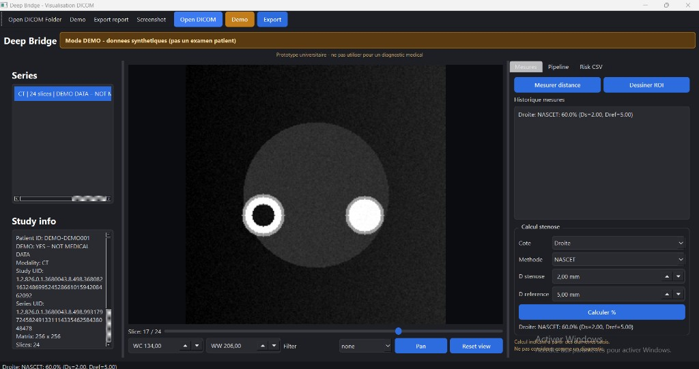
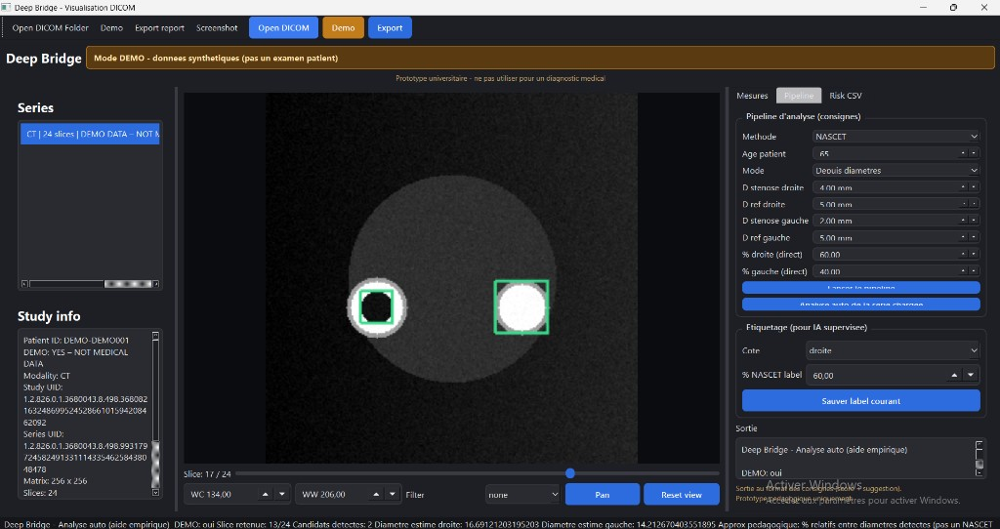
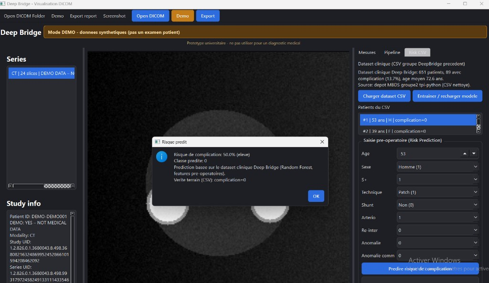
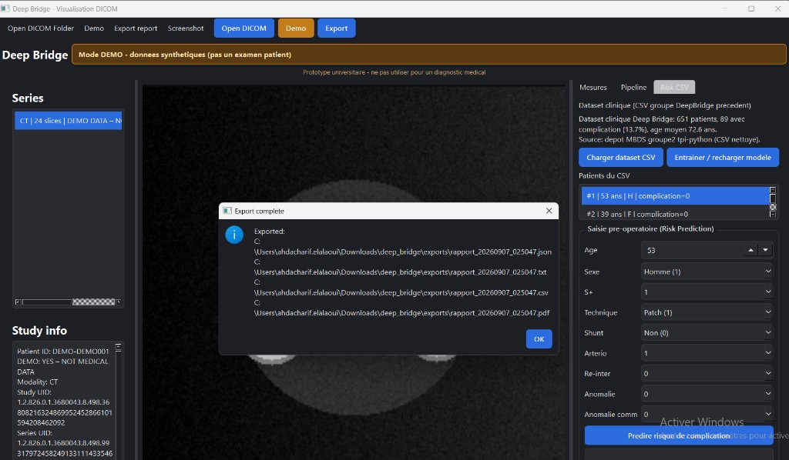

# Rapport de projet — Deep Bridge

**Étudiant :** EL ALAOUI Ahd Acharif  
**Formation :** Master MBDS — Université Côte d’Azur  
**Année :** 2025–2026  
**Projet d’innovation :** Deep Bridge  
**Type de livrable :** application prototype + documentation technique  

> Ce document décrit un **prototype universitaire**.  
> Les sorties de l’outil (pourcentages, suggestions, prédictions) sont **indicatives** et ne constituent **pas** un diagnostic médical.

---

## Table des matières

1. Introduction et sujet  
2. Organisation du travail  
3. État de l’art et recherches effectuées  
4. Objectifs et choix de conception  
5. Réalisations  
6. Résultats, tests et limites  
7. Conclusion et perspectives  
8. Bibliographie / sources  
9. Annexes  

---

## 1. Introduction et sujet

### 1.1 De quoi parle ce projet ?

Deep Bridge est une application de bureau écrite en Python.  
Elle sert à **ouvrir des examens d’imagerie au format DICOM**, à les **visualiser correctement**, à **mesurer** des diamètres liés aux artères carotides, puis à **estimer un pourcentage de sténose** avec des méthodes connues en clinique (NASCET / ECST).

Le projet s’inscrit dans un contexte d’innovation pédagogique autour de la sténose carotidienne. L’idée n’est pas de remplacer un médecin, mais de construire une chaîne logicielle complète, compréhensible et démontrable :

```text
ouvrir un DICOM → voir → localiser / mesurer → calculer un % → exporter
```

En plus de cette chaîne image, j’ai intégré un second volet : une **prédiction de risque de complication** à partir d’un **CSV clinique** (651 patients), issu du travail d’un groupe précédent.

### 1.2 Pourquoi ce sujet ?

La sténose carotidienne correspond à un **rétrécissement des artères carotides**, qui amènent le sang au cerveau.  
Quand ce rétrécissement devient important, le risque d’accident vasculaire cérébral peut augmenter.  
En pratique, on estime souvent un pourcentage de sténose à partir de diamètres mesurés sur l’imagerie.

Les consignes du projet proposaient deux grandes pistes :

1. une approche **empirique** : viewer DICOM, localisation des carotides, NASCET/ECST, score, suggestion ;  
2. une approche **IA supervisée** : annoter, entraîner, détecter / classer plus tard.

J’ai choisi de **prioriser la piste empirique complète**, tout en préparant sérieusement la partie supervisée et en ajoutant le volet Risk CSV dès que les données tabulaires ont été disponibles.

### 1.3 Problème concret rencontré pendant le développement

Pendant la majeure partie du développement, je n’avais **pas accès au dataset DICOM patient** de l’université dans le dépôt public.  
Ce point a fortement influencé mon organisation :

- je n’ai pas inventé de résultats cliniques ;  
- j’ai construit l’application pour de **vrais DICOM** ;  
- j’ai validé le fonctionnement avec un **mode DEMO** (images synthétiques clairement marquées) ;  
- j’ai utilisé le **CSV clinique** disponible pour la partie risque.

### 1.4 Ce que ce rapport contient

Ce rapport présente :

- le **sujet** et le contexte ;  
- mon **organisation** de travail ;  
- l’**état de l’art** / les recherches qui m’ont servi ;  
- les **réalisations** concrètes dans le code ;  
- les **résultats**, limites et perspectives.

---

## 2. Organisation du travail

### 2.1 Méthode de travail

Je n’ai pas travaillé “au hasard fichier par fichier”.  
J’ai découpé le projet en étapes, pour toujours avoir quelque chose de démontrable :

1. **Socle** : structure du projet, dépendances, lancement de l’appli  
2. **DICOM** : lecture d’un dossier, séries, slices  
3. **Viewer** : affichage, contraste, navigation  
4. **Mesures** : distances / diamètres  
5. **Sténose** : NASCET / ECST + grades  
6. **Pipeline** : sortie structurée + analyse d’aide  
7. **DEMO** : données synthétiques pour les tests et la soutenance  
8. **ML / Risk** : étiquetage + CSV clinique + Random Forest  
9. **Qualité** : tests, README, rapport  

Cette organisation m’a permis d’avancer même sans dataset image patient.

### 2.2 Organisation du dépôt

Le code est organisé par responsabilités :

```text
deep_bridge/
├── app/
│   ├── main.py              # point d'entrée
│   ├── report.py            # export de rapports
│   ├── ui/                  # interface PySide6
│   ├── dicom/               # chargement DICOM
│   ├── imaging/             # windowing, filtres, mesures
│   ├── carotid/             # sténose, sévérité, pipeline
│   ├── ml/                  # annotations + risk model
│   └── utils/               # chemins, logs, DEMO
├── tests/                   # tests unitaires
├── data/                    # DEMO + dataset CSV
├── docs/                    # documentation / rapport
├── scripts/                 # scripts utilitaires
├── README.md
└── requirements.txt
```

L’idée est simple : si je modifie le calcul NASCET, je ne casse pas forcément le loader DICOM.  
Si j’améliore le Risk CSV, je ne touche pas au viewer.

### 2.3 Planning global (résumé)

| Phase | Contenu principal | Livrable visible |
|------|--------------------|------------------|
| 1 | Setup + architecture | appli qui démarre |
| 2 | DICOM + viewer | ouverture / navigation |
| 3 | Mesures + NASCET | calcul de % |
| 4 | Pipeline + grades | sortie “consignes” |
| 5 | Mode DEMO | démo sans dataset patient |
| 6 | Risk CSV + tests | prédiction + pytest |
| 7 | Documentation | README + rapport |

### 2.4 Difficultés d’organisation

La difficulté principale a été le **manque d’images patient**.  
Sans ça, on ne peut pas “finir” une IA image de façon honnête.

Ma réponse a été pragmatique :

- livrer une **chaîne empirique complète** ;  
- garder une **porte ouverte** vers l’IA image (annotations, stubs) ;  
- utiliser ce qui était réellement disponible : **CSV clinique**.

### 2.5 Outils utilisés au quotidien

- Python 3  
- Visual Studio Code / terminal  
- Git (pour le dépôt Classroom)  
- pytest pour vérifier les parties critiques  
- PowerPoint pour la soutenance (hors dépôt principal si besoin)

---

## 3. État de l’art et recherches effectuées

Cette partie résume ce que j’ai lu / regardé pour construire le projet correctement, sans prétendre faire une revue scientifique exhaustive.

### 3.1 Imagerie DICOM et visualisation

DICOM est le standard d’échange des images médicales.  
Un fichier DICOM ne contient pas seulement des pixels : il contient aussi des métadonnées (modalité, série, position, spacing, etc.).

Pour un projet comme le mien, plusieurs points reviennent souvent dans la littérature technique et les documentations :

- il faut **grouper** les images par série (`SeriesInstanceUID`) ;  
- il faut **ordonner** les slices ;  
- il faut gérer le **windowing** (Window Center / Window Width), car une image CT brute est souvent illisible “telle quelle” ;  
- le `PixelSpacing` est important si on veut mesurer en millimètres.

J’ai donc orienté le viewer vers une approche classique et robuste :

- charger un dossier ;  
- choisir une série ;  
- naviguer slice par slice ;  
- régler WC/WW ;  
- zoomer / se déplacer.

Cette approche est cohérente avec les consignes du projet, qui déconseillaient les approches du type “tout afficher en 3D”.

Pour formaliser le scénario d’usage principal, j’ai aussi représenté le **diagramme de séquence** d’une analyse typique (chargement → visualisation → mesure → calcul → export). Ce type de diagramme est classique en conception logicielle : il montre qui fait quoi, et dans quel ordre.



**Figure 1 – Diagramme de séquence d’une analyse typique**  
L’utilisateur interagit avec l’interface ; le loader prépare les séries ; le viewer affiche ; le module carotid calcule ; l’export produit le rapport.

### 3.2 Sténose carotidienne, NASCET et ECST

La quantification de la sténose carotidienne repose souvent sur des formules à partir de diamètres.

La formule **NASCET** la plus connue s’écrit :

```text
% sténose = 100 × (1 - D_stenose / D_reference)
```

où :

- `D_stenose` est le diamètre résiduel au niveau du rétrécissement ;  
- `D_reference` est un diamètre de référence distal.

La méthode **ECST** utilise une logique proche, mais avec une référence différente (liée au bulbe).  
Dans mon application, l’utilisateur choisit la méthode et saisit les diamètres.  
Le logiciel calcule ensuite le pourcentage de façon transparente.

J’ai aussi regardé les ordres de grandeur de sévérité souvent utilisés pédagogiquement :

| Pourcentage (NASCET) | Lecture simple |
|----------------------|----------------|
| < 50 % | sténose légère |
| 50–69 % | sténose modérée |
| 70–99 % | sténose sévère |
| ≈ 100 % | occlusion |

Ces seuils m’ont servi à construire un **score de gravité pédagogique**, clairement présenté comme non clinique.

### 3.3 Localisation des carotides : manuel puis automatique

Dans beaucoup de prototypes, on commence par une localisation **manuelle** (ROI), car c’est :

- plus simple à valider ;  
- plus honnête sans dataset annoté ;  
- utile pour préparer l’étiquetage.

Les approches automatiques sur images 2D peuvent utiliser :

- la détection de cercles / contours ;  
- des méthodes de vision classique (Hough, seuillage) ;  
- plus tard, des réseaux de neurones si on a assez d’annotations.

Sans dataset patient annoté, j’ai choisi une détection d’aide par vision classique (Hough), présentée comme **aide expérimentale**, pas comme modèle validé.

### 3.4 Machine learning en imagerie médicale

L’état de l’art actuel en détection / segmentation médicale s’appuie beaucoup sur l’apprentissage supervisé (CNN, U-Net, etc.).  
Mais ces approches demandent :

- des données ;  
- des annotations de qualité ;  
- un protocole d’évaluation sérieux (split patient, métriques, validation).

Les consignes du projet indiquaient d’ailleurs que les approches non supervisées passées n’avaient pas donné de bons résultats, et qu’il fallait plutôt viser du **supervisé**.

Dans mon cas, sans annotations image disponibles, entraîner un réseau “pour faire joli” aurait été trompeur.  
J’ai donc :

- préparé le **cadre** (labels, export JSON, stubs) ;  
- entraîné réellement ce qui était possible : un **Random Forest** sur CSV clinique.

### 3.5 Travaux proches / ressources utilisées

Pour avancer, je me suis appuyé notamment sur :

- la documentation **pydicom** (lecture DICOM) ;  
- la documentation **PySide6 / Qt** (interface) ;  
- NumPy / OpenCV pour le traitement d’image ;  
- scikit-learn pour le ML tabulaire ;  
- le dépôt et le travail du **groupe précédent Deep Bridge** (CSV clinique, idée de Risk Prediction) ;  
- des rappels sur NASCET / ECST issus de ressources cliniques pédagogiques.

Le CSV intégré (`deep-bridge-data-clean.csv`) contient **651 patients**, avec une variable cible `complication`.  
C’est cette base qui m’a permis d’avoir un vrai volet ML entraînable pendant le projet.

### 3.6 Architecture logicielle en couches (diagramme académique)

Au-delà du domaine médical, j’ai aussi regardé comment structurer une application sérieusement.  
Une représentation académique classique est l’**architecture en couches** :

- couche présentation (interface) ;  
- couche domaine (DICOM, imaging, carotid, ML) ;  
- couche données / sorties (DEMO, CSV, exports).



**Figure 2 – Architecture en couches de Deep Bridge**  
Ce schéma m’a servi de guide pour découper le code et éviter un “gros fichier unique”.

### 3.7 Ce que cette recherche m’a appris concrètement

1. Un bon viewer DICOM vaut mieux qu’une démo 3D confuse.  
2. NASCET n’a de sens que si les diamètres sont clairs et traçables.  
3. Sans annotations, on ne doit pas inventer une IA image “performante”.  
4. Un CSV clinique peut déjà servir à démontrer un vrai apprentissage supervisé.  
5. La séparation image / données tabulaires est une architecture saine.

---

## 4. Objectifs et choix de conception

### 4.1 Objectifs retenus

1. Charger un dossier DICOM et organiser les séries  
2. Visualiser les coupes (contraste, zoom, navigation)  
3. Localiser les carotides (ROI manuelle + aide automatique)  
4. Mesurer des diamètres  
5. Calculer NASCET / ECST  
6. Scorer la gravité  
7. Produire une sortie pipeline (droite / gauche + suggestion pédagogique)  
8. Exporter un rapport  
9. Intégrer un Risk Prediction sur CSV clinique  
10. Préparer l’étiquetage pour une future IA image  

### 4.2 Choix principaux

**Choix 1 — Python + PySide6**  
Pour livrer rapidement une application de bureau complète, testable, et adaptée à une démo universitaire.

**Choix 2 — Piste empirique d’abord**  
Parce que c’était la seule façon d’avoir une chaîne complète sans dataset image annoté.

**Choix 3 — Mode DEMO explicite**  
Pour avancer et présenter sans faire croire que j’utilise de vrais patients.

**Choix 4 — Risk CSV réel**  
Pour ne pas laisser la partie ML uniquement “théorique”.

**Choix 5 — Pas de deep learning image “fake”**  
Je préfère dire clairement ce qui marche et ce qui manque.

### 4.3 Ce qui n’a pas été retenu

- reconstruction 3D globale “tout montrer” ;  
- migration C# / CUDA dès le début ;  
- revendiquer une IA image entraînée sans données.

### 4.4 Stack technique

| Composant | Technologie | Rôle |
|----------|-------------|------|
| Langage | Python | cœur du projet |
| UI | PySide6 | interface |
| DICOM | pydicom | lecture des examens |
| Image | NumPy, OpenCV | pixels, filtres, détection d’aide |
| ML | scikit-learn | Risk Prediction |
| Tests | pytest | non-régression |
| Export | JSON / TXT / CSV / PDF | rapports |

---

## 5. Réalisations

### 5.1 Vue d’ensemble de ce qui a été développé

L’application Deep Bridge propose aujourd’hui :

- ouverture d’un dossier DICOM ;  
- bouton **Demo** ;  
- viewer avec navigation et windowing ;  
- onglet **Mesures** (distance, ROI, NASCET/ECST) ;  
- onglet **Pipeline** (analyse structurée + auto) ;  
- onglet **Risk CSV** (chargement dataset, entraînement, prédiction) ;  
- export de rapport ;  
- bannières / messages rappelant le caractère prototype.

Les captures ci-dessous montrent l’interface réelle du prototype (mode DEMO).



**Figure 3 – Mode DEMO / viewer**  
Série synthétique chargée, bannière DEMO visible, navigation slice par slice.



**Figure 4 – Mesures / NASCET**  
Exemple de calcul à partir de diamètres saisis (résultat affiché dans l’historique).



**Figure 5 – Pipeline d’analyse**  
Sortie structurée et ROI candidates proposées automatiquement (aide expérimentale).



**Figure 6 – Risk CSV**  
Dataset clinique (651 patients) et prédiction de risque de complication (Random Forest).



**Figure 7 – Export**  
Génération des fichiers JSON, TXT, CSV et PDF dans le dossier `exports/`.

### 5.2 Chargement DICOM

**Module :** `app/dicom`

Réalisé :

- parcours récursif d’un dossier ;  
- ignore des fichiers non DICOM ;  
- lecture via pydicom ;  
- groupement par `SeriesInstanceUID` ;  
- tri des slices ;  
- extraction de métadonnées techniques ;  
- affichage anonymisé / prudent des infos patient.

Cette partie est essentielle : sans elle, il n’y a pas d’application d’imagerie.

### 5.3 Visualisation

**Modules :** `app/ui`, `app/imaging`

Réalisé :

- liste des séries ;  
- slider de slices ;  
- Window Center / Window Width ;  
- zoom molette ;  
- pan ;  
- filtres optionnels (gaussien, médian, CLAHE, sharpen) ;  
- panneau d’informations de l’étude.

Le viewer a demandé plusieurs correctifs d’affichage sous Windows (rendu Qt / stylesheet).  
Au final, l’image DEMO s’affiche correctement et permet une démo orale.

### 5.4 Mesures et calcul de sténose

**Modules :** `app/imaging/measurements.py`, `app/carotid/stenosis.py`, UI Mesures

Réalisé :

- mesure de distance ;  
- conversion mm si `PixelSpacing` disponible ;  
- saisie des diamètres ;  
- calcul NASCET / ECST ;  
- historique des mesures ;  
- affichage du résultat dans l’interface.

Exemple :

```text
Ds = 2 mm
Dref = 5 mm
NASCET = 100 × (1 - 2/5) = 60 %
```

### 5.5 Sévérité et recommandation pédagogique

**Modules :** `severity.py`, `recommendation.py`

À partir du pourcentage, l’application propose un grade (légère / modérée / sévère / occlusion)  
et une suggestion pédagogique (surveillance, suivi, discussion d’intervention…).

Ces messages sont volontairement prudents et non présentés comme une décision médicale.

### 5.6 Pipeline d’analyse

**Modules :** `pipeline.py`, panneau Analyse

Le pipeline permet d’obtenir une sortie du type demandé dans l’esprit des consignes :

- % droite / gauche ;  
- grades ;  
- suggestion globale ;  
- possibilité de lancer une analyse automatique d’aide sur la série chargée.

L’analyse auto place des ROI candidates sur l’image.  
Je la présente comme une **aide de prototype**, pas comme une détection clinique.

### 5.7 Mode DEMO

**Module / script :** `utils/demo_data.py`, `scripts/generate_demo_data.py`

Comme les DICOM patients n’étaient pas disponibles, j’ai généré une série synthétique (24 slices).  
Elle est marquée clairement :

- métadonnées DEMO ;  
- bannière dans l’UI ;  
- messages “NOT MEDICAL DATA”.

Cela m’a permis de tester toute la chaîne et de faire la soutenance sans données sensibles.

### 5.8 Volet Risk CSV (réalisé et entraînable)

**Modules :** `app/ml/clinical_dataset.py`, `risk_model.py`, UI Risk CSV

Réalisé :

- chargement du CSV clinique nettoyé (651 patients) ;  
- résumé du dataset ;  
- entraînement / rechargement d’un Random Forest ;  
- prédiction de risque de complication ;  
- comparaison éventuelle avec la vérité terrain du CSV ;  
- intégration possible dans le rapport exporté.

Ce volet est important pédagogiquement :  
il montre un vrai apprentissage supervisé sur des données disponibles, sans inventer une IA image.

### 5.9 Étiquetage et préparation IA image

**Module :** `app/ml`

Réalisé :

- sauvegarde de labels (côté, %, grade, ROI, série, slice) ;  
- structure pour annotations ;  
- scripts d’aide à l’entraînement supervise minimal ;  
- stubs pour une future détection / segmentation.

Cette partie est volontairement présentée comme **préparatoire**.

### 5.10 Export de rapports

**Module :** `report.py`

L’utilisateur peut exporter :

- JSON  
- TXT  
- CSV  
- PDF  

dans le dossier `exports/`.  
Le rapport peut contenir mesures, NASCET, sortie pipeline et risque prédit.

### 5.11 Qualité logicielle

- `README.md` pour installer / lancer ;  
- `requirements.txt` ;  
- tests `pytest` sur les parties critiques (loader, calculs, etc.) ;  
- scripts de génération DEMO / entraînement risque.

---

## 6. Résultats, tests et limites

### 6.1 Ce qui fonctionne aujourd’hui

| Fonction | État |
|----------|------|
| Chargement DICOM dossier | OK |
| Mode DEMO | OK |
| Viewer + WC/WW + zoom/pan | OK |
| Mesures + NASCET/ECST | OK |
| Pipeline + suggestion pédagogique | OK |
| Analyse auto d’aide | OK (expérimental) |
| Risk CSV Random Forest | OK |
| Export multi-format | OK |
| Tests unitaires | OK |

### 6.2 Exemple de parcours de démonstration

1. Lancer `python -m app.main`  
2. Cliquer **Demo**  
3. Naviguer dans les slices / régler le contraste  
4. Calculer un NASCET (ex. 60 %)  
5. Lancer le pipeline  
6. Charger le CSV et prédire un risque  
7. Exporter le rapport  

### 6.3 Exemple de sortie pipeline

Pour une saisie du type droite = 100 %, gauche = 40 %, âge = 68 :

- carotide droite : occlusion / très sévère ;  
- carotide gauche : sténose légère ;  
- suggestion pédagogique : discussion d’une prise en charge plus invasive à droite.

### 6.4 Limites assumées

1. **Pas d’évaluation image sur dataset universitaire patient** pendant le développement.  
2. La détection automatique reste une **aide**, non validée cliniquement.  
3. Les suggestions d’action sont **pédagogiques**.  
4. L’IA image n’est **pas** un modèle final entraîné sur patients.  
5. La qualité des mesures dépend encore fortement de l’utilisateur.

Ces limites ne sont pas cachées : elles font partie du rendu honnête du projet.

### 6.5 Conformité avec l’esprit des consignes

| Attendu | Couverture |
|---------|------------|
| Lire / visualiser DICOM | Oui |
| Cibler l’affichage | Oui |
| Localiser carotides (manuel puis auto) | Oui (auto = aide) |
| NASCET / ECST | Oui |
| Score de gravité | Oui |
| Pipeline de sortie | Oui |
| IA supervisée | Démarrée + Risk CSV réel |
| Dataset image univ. | Non disponible → DEMO |
| Approche 3D globale | Non retenue |

---

## 7. Conclusion et perspectives

### 7.1 Conclusion

Deep Bridge est un prototype qui couvre une chaîne complète côté imagerie :

**DICOM → visualisation → mesures → NASCET/ECST → pipeline → export**,  
et un second axe clinique :

**CSV patient → Random Forest → risque de complication**.

Le projet répond à l’objectif pédagogique demandé : construire une solution structurée, démontrable, et prête à accueillir de vraies données image dès qu’elles sont disponibles.

### 7.2 Perspectives

Dès accès au dataset universitaire annoté, les prochaines étapes naturelles seraient :

1. ouvrir de vrais dossiers patients dans l’outil ;  
2. annoter massivement (ROI, côté, grade) ;  
3. entraîner une détection / segmentation supervisée sur images ;  
4. comparer les % calculés aux références cliniques disponibles ;  
5. évaluer proprement les performances (split patient, métriques, erreurs) ;  
6. améliorer l’UX et éventuellement les performances (GPU) si nécessaire.

### 7.3 Bilan personnel

Ce projet m’a permis de relier plusieurs compétences :

- développement d’une application complète ;  
- manipulation de données médicales (DICOM + CSV) ;  
- compréhension d’un problème clinique simplifié (sténose / NASCET) ;  
- mise en place d’un premier modèle ML réel ;  
- documentation et préparation de soutenance.

Le point le plus important que je retiens :  
dans un projet santé / innovation, il vaut mieux **montrer clairement ce qui marche** et **ce qui manque**, plutôt que d’inventer des résultats.

---

## 8. Bibliographie / sources

Sources et références utilisées pour mener le projet (documentation technique et ressources pédagogiques) :

1. Documentation pydicom — lecture et manipulation de fichiers DICOM.  
2. Documentation Qt / PySide6 — interfaces graphiques Python.  
3. Documentation NumPy / OpenCV — traitement d’images.  
4. Documentation scikit-learn — Random Forest et métriques de classification.  
5. Ressources pédagogiques sur les méthodes **NASCET** et **ECST** pour la quantification de sténose carotidienne.  
6. Dépôt / travaux du groupe précédent Deep Bridge (CSV clinique, Risk Prediction).  
7. Consignes du projet d’innovation Deep Bridge (objectifs empiriques + IA supervisée).

*(Ce n’est pas une revue bibliographique exhaustive ; ce sont les sources réellement utilisées pour construire le prototype.)*

---

## 9. Annexes

### Annexe A — Installation rapide

```powershell
cd deep_bridge
python -m venv .venv
.\.venv\Scripts\Activate.ps1
pip install -r requirements.txt
python scripts/generate_demo_data.py
python scripts/train_risk_model.py
python -m app.main
```

### Annexe B — Commandes utiles

```powershell
pytest
python scripts/generate_demo_data.py
python scripts/train_risk_model.py
python -m app.main
```

### Annexe C — Structure des livrables dans le dépôt

- code source : `app/`, `tests/`, `scripts/`  
- données DEMO / CSV : `data/`  
- documentation : `docs/` (dont ce rapport)  
- README d’installation : `README.md`

### Annexe D — Rappel éthique

- aucune donnée patient réelle n’est présentée comme donnée de démo ;  
- le mode DEMO est explicitement synthétique ;  
- les sorties de l’outil ne doivent pas servir à une décision médicale réelle.

---

**Fin du rapport**
