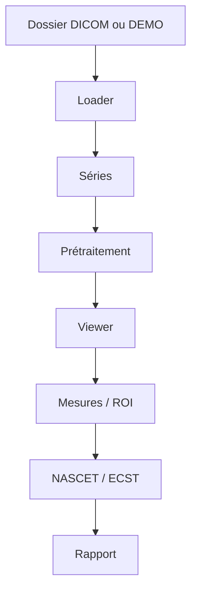

# Architecture – Deep Bridge

## Idée générale

L’appli suit un enchaînement simple :

```text
dossier DICOM → chargement → séries → affichage → mesures → % sténose → export
```

## Modules

- `app/dicom` : lire les fichiers, regrouper par série, récupérer les métadonnées utiles
- `app/imaging` : windowing, filtres, distances
- `app/carotid` : ROI manuelle + calcul NASCET/ECST
- `app/ml` : place pour un futur modèle (pas entraîné)
- `app/ui` : interface
- `app/report.py` : export txt/json/csv/pdf

## Schéma



## Ce qui marche aujourd’hui

Chargement, visualisation, mesures, calcul manuel du %, DEMO, export.

## Ce qui reste à faire plus tard

Détection / segmentation automatique, entraînement sur le dataset universitaire.
